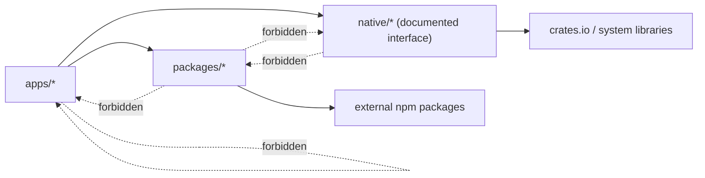

# Dependency Boundaries

Senclaw keeps the monorepo intentionally simple:

- Apps own runtime behavior and may depend on shared packages.
- Shared packages own reusable contracts and helpers.
- Native modules are invoked only through explicit interfaces from apps.
- App-to-app dependencies are prohibited.

## Allowed Directions

| From | May depend on | Must not depend on |
| --- | --- | --- |
| `apps/*` | `packages/*`, external npm packages, `native/*` via CLI or FFI boundary | Other `apps/*` directories |
| `packages/*` | External npm packages, other `packages/*` when the dependency is acyclic and shared | Any `apps/*` directory, any `native/*` boundary |
| `native/*` | Rust crates, system libraries, platform APIs | `apps/*` source, `packages/*` source |

## Boundary Rules

1. App-to-app imports are never allowed.
2. Shared logic used by more than one app moves into `packages/`.
3. Rust components stay under `native/` and are called through a documented interface.
4. Packages cannot reach upward into app runtime code.
5. Packages cannot hide shell/process behavior that belongs in a native boundary.

## Diagram

## Current Workspace Shape

- Apps: `gateway`, `web`, `agent-runner`, `connector-worker`, `tool-runner-host`, `scheduler`
- Shared packages: `protocol`, `config`, `logging`, `observability`
- Native boundary area: reserved for future Rust crates such as sandbox runners or process supervisors