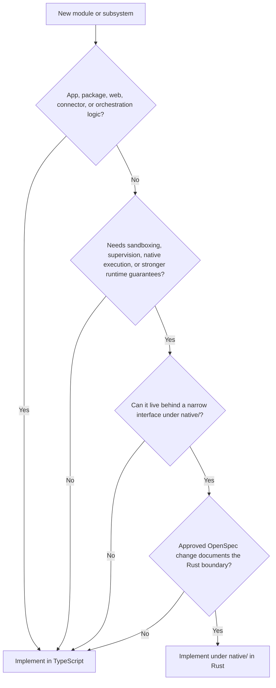

# Module Ownership

Senclaw v1 defaults to TypeScript for every control-plane module under `apps/` and `packages/`. Rust is reserved for future boundary components that need stronger process isolation, sandboxing, native execution control, or tighter resource guarantees than Node.js can reasonably provide.

## Ownership Matrix

| Module | Layer | Default language | Why TypeScript owns it | When Rust is allowed |
| --- | --- | --- | --- | --- |
| `apps/gateway` | API and session ingress | TypeScript | HTTP, WebSocket, auth, and orchestration logic are I/O-heavy and change quickly. | Only for a separately owned native edge helper behind `native/` if protocol parsing or transport isolation becomes a hard requirement. |
| `apps/web` | Operator UI host | TypeScript | Web delivery, SSR/static hosting, and UI integration live in the JS toolchain. | Not in v1. Any Rust usage would have to stay behind a build-time helper approved in OpenSpec. |
| `apps/agent-runner` | Agent orchestration | TypeScript | Prompt assembly, tool routing, and async control flow benefit from the TS ecosystem. | Only for a subordinate sandbox/executor invoked through `native/`. |
| `apps/connector-worker` | External channel workers | TypeScript | SDK integration and webhook handling fit Node.js best. | Only for a native adapter where protocol isolation or vendor SDK constraints justify it. |
| `apps/tool-runner-host` | Tool invocation host | TypeScript | Approval flow, request validation, and orchestration remain TS-owned. | Yes, but only for child modules such as a sandbox runner or process supervisor that live under `native/`. |
| `apps/scheduler` | Job orchestration | TypeScript | Schedules, retries, and persistence are orchestration work, not systems work. | Only if a future timing/process boundary proves TS is insufficient and the change is documented. |
| `packages/protocol` | Shared contracts | TypeScript | Protocol types and manifest helpers should be easy for all apps to consume. | Not in v1. Rust would make the simplest shared contract harder to evolve. |
| `packages/config` | Config loading | TypeScript | Environment parsing and service wiring are standard TS concerns. | Not in v1. |
| `packages/logging` | Logging helpers | TypeScript | Structured logging adapters are straightforward JS/TS code. | Not in v1. |
| `packages/observability` | Health and metrics helpers | TypeScript | Shared health payloads and instrumentation wrappers belong in the TS workspace. | Only for a future native exporter that remains outside `packages/`. |
| `native/*` | Boundary components | Rust | Not applicable. `native/` exists specifically for Rust-owned boundary modules. | Rust is the default here, but every crate still needs an approved purpose, interface contract, and owner. |

## TypeScript vs Rust Checklist

Choose TypeScript unless every answer in the Rust path is yes.

1. Is the module part of the user-facing control plane, orchestration flow, connector logic, shared app contract, or web surface?
   - If yes, keep it in TypeScript.
2. Does the module need hard process isolation, OS-level sandboxing, child-process supervision, native execution, or resource guarantees that are difficult to enforce in Node.js?
   - If no, keep it in TypeScript.
3. Can the native behavior be isolated behind a narrow CLI or FFI boundary under `native/` without leaking Rust into app/package dependency graphs?
   - If no, redesign the module and keep it in TypeScript.
4. Is there an approved OpenSpec change documenting why TypeScript is insufficient, what interface the Rust boundary exposes, and how Windows/Linux verification will work?
   - If no, do not introduce Rust.

## Decision Flow

See `native/README.md` for the crate layout and invocation contract once a Rust boundary is approved.